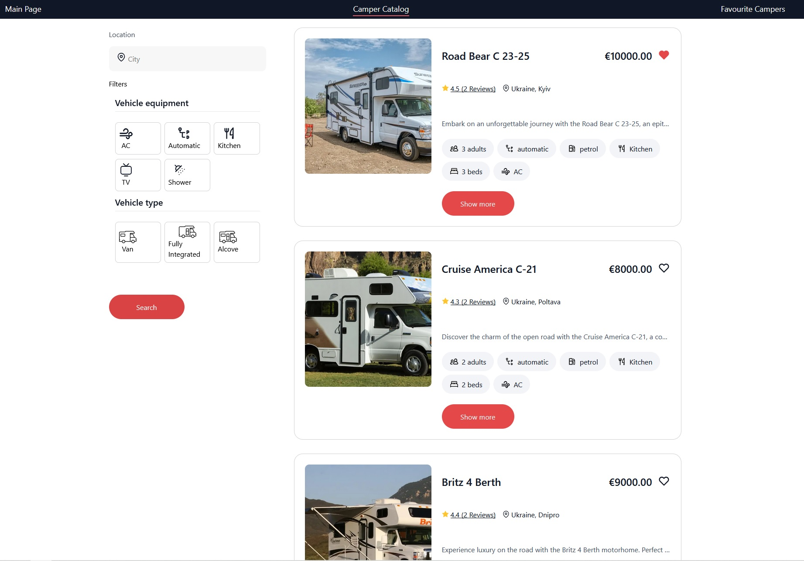

# CamperWay

CamperWay is a React application built with Vite that provides an intuitive interface for browsing and booking campers.

## Features

- Browse camper listings with detailed information.
- View camper features and reviews.
- Book campers through a user-friendly form.

## Pages
- Main Page
- Camper Catalog
- Favourite Campers

## Technologies Used

- **React**: A JavaScript library for building user interfaces.
- **Vite**: A build tool that provides a fast development experience.
- **@vitejs/plugin-react**: Provides fast refresh for React using Babel.
- **@vitejs/plugin-react-swc**: An alternative plugin that uses SWC for fast refresh.

